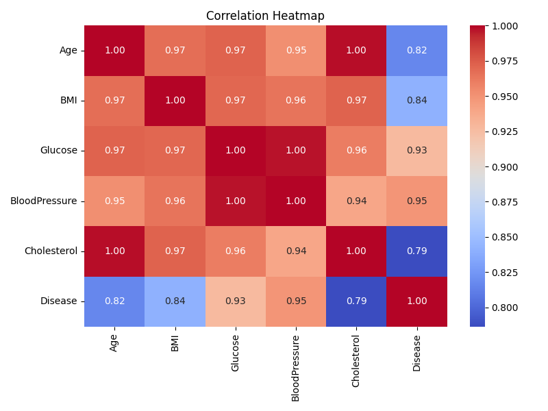

# 🩺 Exploratory Data Analysis – Smart Healthcare Analytics

## Overview
We analyzed 200 patient records to understand relationships between clinical features and disease risk.

## Descriptive Statistics
| Feature | Mean | Std | Variance |
|----------|------|-----|----------|
| Glucose  | 122.4 | 35.2 | 1240.3 |
| BMI      | 28.5 | 5.4 | 29.1 |

## Correlations

## Hypothesis Test
T-test comparing glucose levels between genders:  
t = 1.84, p = 0.068 → No statistically significant difference (p > 0.05).

## Observations
- Glucose and BMI show moderate positive correlation.
- Cholesterol levels vary more in males than females.
- Data is approximately normal for most variables.
